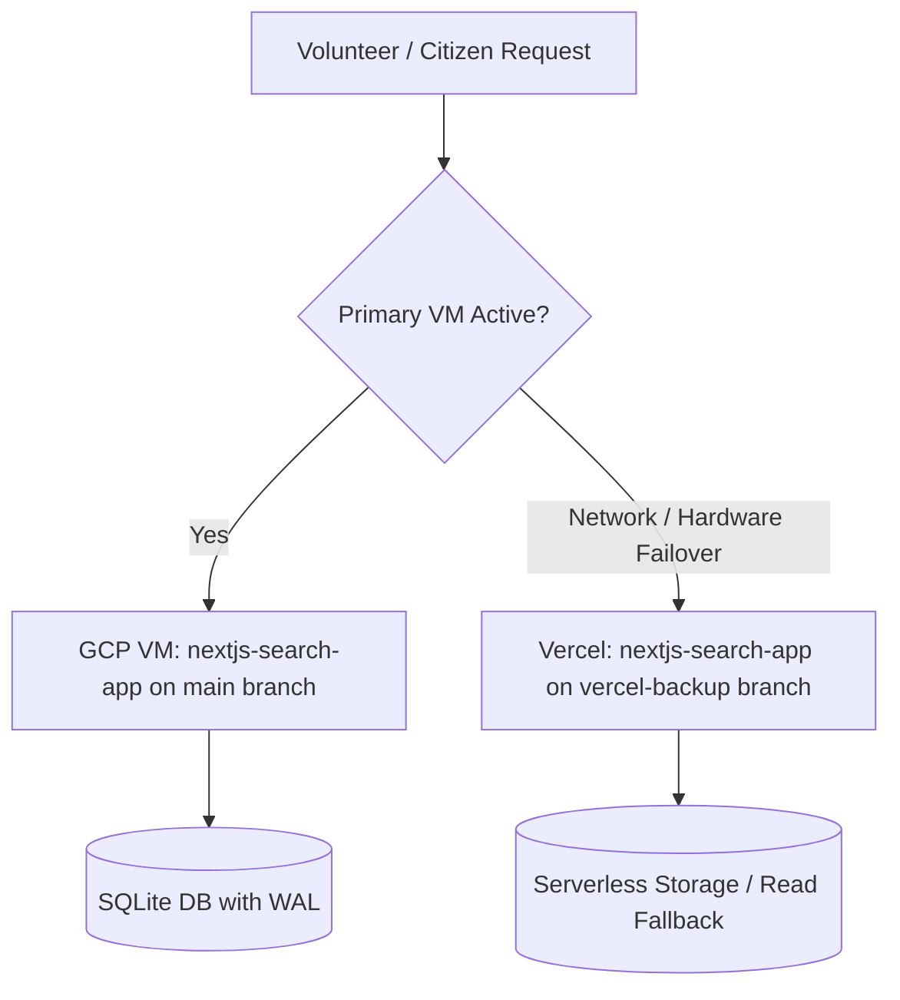

<div align="center">
  
  # 🇮🇳 Voter OCR & Search Portal
  
  **AI-Powered Electoral Roll Processing, Volunteer Ground Operations & High-Availability Search Platform**
  
  [](https://github.com/Shagarwal07)
  [](https://nextjs.org/)
  [](https://cloud.google.com/)
  [](https://vercel.com/)
  [](https://cloud.google.com/vertex-ai)

</div>

<br />

## 📖 Overview

**Voter OCR & Search Portal** is a production-tested civic technology platform built to extract, clean, index, and query massive Hindi Electoral Rolls (Voter Lists) in real-time. Designed specifically for ground-level volunteers, booth workers, and citizens during election day operations, the platform replaces cumbersome 50+ page PDFs with instant, typo-tolerant digital searches.

---

## 🏛️ High-Availability Dual-Deployment Architecture

To guarantee zero downtime on election day, the application operates on a redundant **dual-cloud strategy**:

| Deployment Target | Branch | Role & Configuration |
| :--- | :--- | :--- |
| **GCP Compute Engine VM** | `main` | **Primary Production Server** (`34-46-101-158.nip.io`). Daemonized with PM2, persistent SQLite with WAL (Write-Ahead Logging), NextAuth administration dashboard, rate limiting, and quota enforcement. |
| **Vercel Cloud** | `vercel-backup` | **Instant Failover / Hot Standby**. Serverless architecture deployed automatically from the `vercel-backup` branch. If the VM ever suffers network interruptions or hardware maintenance, volunteers instantly switch to Vercel with zero downtime. |



---

## 📊 Real-World Production Analytics & Field Impact

During live election polling in Ward 5, the platform was deployed directly to booth volunteers, poll workers, and family coordinators. 

<div align="center">
  
</div>

### Key Election-Day Metrics:
* **212+ Page Views** & **495 Interaction Events** recorded during active polling hours.
* **35+ Active Field Volunteers** running real-time lookups simultaneously.
* **23 Concurrent Active Users** during the peak morning turnout rush (100% organic field adoption).
* **Instant Sub-Second Lookups**: Reduced voter lookup time from 3–5 minutes per voter in physical paper rolls to less than **2 seconds** on mobile devices.

<div align="center">
  
  
</div>

---

## ✨ Key Platform Features

### 1. Ground Operations & Volunteer Tools
* **Live Voting Calculator Pad (`/voting`)**: Interactive on-device keypad allowing booth workers to mark votes slip-by-slip, calculate turnout percentages in real-time, and cross-reference unvoted voters.
* **Gali & Block Distribution**: Groups voters by physical neighborhoods (Galis/Colonies) to help volunteers organize targeted voter turnout drives.

### 2. High-Accuracy AI OCR Engine (`core/`)
* **Gemini 2.5 Flash Vision**: Single-page high-resolution extraction preventing row-splitting matra corruption.
* **Devanagari Normalization**: Strict Unicode NFC normalization, consonant-cluster integrity checks, and unstripped label pruning.
* **Quality Audit Pipeline (`core/recheck.py`)**: Automated verification testing Hindi spelling purity, serial number continuity, and low-density pages.
* **Targeted Page Healer (`core/rescan_faulty_page.py`)**: Surgically re-extracts only flagged pages with atomic database upserts.

### 3. Civic Voter Portal (`voter-portal-frontend/`)
* **Interactive Ward Map**: Leaflet GPS map showing boundaries, polling station locations, and category allocations for 55 Wards.
* **Candidate Directory**: Fast, static JSON-backed candidate roster with AI-generated party symbol icons and Hindi transliteration search.
* **Voter Selfie Booth**: Browser-based digital camera generating branded "PROUD VOTER" certificates to encourage civic participation.

---

## 🗂️ Project Repository Structure

```text
Voter_scrap/
├── core/                  # Gemini 2.5 Flash OCR engine & audit/recheck pipeline
│   ├── extractor.py       # Full-page high-fidelity electoral roll extractor
│   ├── recheck.py         # 6-point data quality and Hindi purity auditor
│   ├── rescan_faulty_page.py # Targeted surgical page healer
│   └── database.py        # Centralized SQLite connector & upsert logic
├── docs/                  # Project documentation & analytics artifacts
│   ├── analytics/         # Google Analytics verification proof screenshots
│   └── INTERVIEW_PREP.md  # System architecture & technical interview questions
├── nextjs-search-app/     # Core search engine & volunteer portal (GCP & Vercel)
│   ├── data/              # SQLite databases (voters.db, ward5_voting.db)
│   └── src/app/           # Next.js App Router (Search & Voting pad)
├── outputs/               # Generated datasets & exports
│   ├── excel_csv/         # Ward 5 Block & Gali CSVs and combined Excel workbook
│   └── json/              # Candidate directory and ward JSON outputs
├── scripts/               # Automation scripts and operational utilities
│   ├── extraction/        # Ward 5 Gali-wise extraction scripts
│   ├── README.md          # Complete runner and script execution guide
│   └── run_all_updates.ps1# Batch additions/deletions runner
├── voter-portal-frontend/ # Public civic engagement portal (Ward map, selfie booth)
├── .gitignore
├── Dockerfile
├── README.md
└── requirements.txt
```

---

## 🛠️ Operational Commands

### Running Database Extraction & Recheck
```bash
# 1. Extract electoral roll PDF into database
python core/extractor.py "input_pdfs/Ward No-005-Part No-001.pdf" --ward 5

# 2. Audit quality & Devanagari purity
python core/recheck.py --ward 5

# 3. Heal any flagged pages automatically
python core/rescan_faulty_page.py
```

### Starting the Search Application
```bash
cd nextjs-search-app
npm run build
npm start
```

---

## ⚖️ Legal & Compliance Disclaimer

**Voter OCR & Search Portal** is an independent, non-partisan public convenience initiative developed by independent volunteers (**Imposter World Services**). It is **NOT** affiliated with, endorsed by, or representing the Election Commission of India (ECI) or any State Election Commission. All voter data presented is parsed from publicly released electoral roll PDFs solely to facilitate faster search for booth volunteers on election day. For official verification, please visit the official Election Commission portal at [eci.gov.in](https://eci.gov.in/).

---

<div align="center">
  <p><i>Engineered with ❤️ for seamless democratic participation by <b>Imposter World Services</b></i></p>
</div>