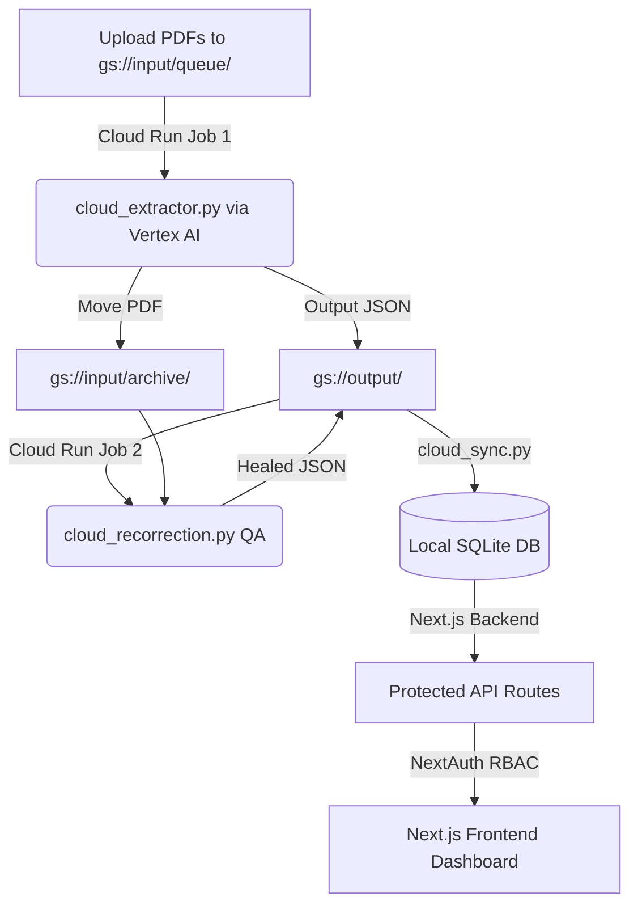

<div align="center">
  
  # 🇮🇳 Voter OCR & Search Portal (Enterprise Edition)
  
  **AI-Powered Electoral Roll Extraction & Secure Next.js Admin Dashboard**
  
  [](https://github.com/Shagarwal07)
  [](https://nextjs.org/)
  [](https://cloud.google.com/)
  [](https://cloud.google.com/vertex-ai)

</div>

<br />

## 📖 Overview

**Voter OCR & Search Portal** is a production-grade, cloud-native architecture designed to process thousands of pages of messy, unstructured Hindi Electoral Rolls (PDFs) and serve them through a highly secure, lightning-fast web portal.

The system uses a highly scalable **Google Cloud Run** architecture to process PDFs in parallel using **Vertex AI (Gemini 2.5 Vision)**. It features an automated QA "auto-healing" pipeline, and a beautifully designed **Next.js** frontend deployed on a **Google Compute Engine (GCP)** VM using PM2.

---

## ✨ Key Features

- **🚀 Serverless Parallel OCR Pipeline**: Uses Google Cloud Run Jobs to process up to 50 PDFs simultaneously. 
- **📂 Queue-to-Archive Architecture**: Flawless state management. PDFs uploaded to `queue/` are processed and automatically migrated to `archive/` to guarantee idempotency and prevent duplicate processing.
- **🤖 Auto-Healing AI (Recorrection)**: A dedicated Cloud Run QA job crops and re-reads specific page segments, mathematically cross-checks them against the JSON output, and auto-heals any AI hallucinations or "gibberish".
- **🔐 Role-Based Access Control (RBAC)**: Secure Admin Dashboard using `NextAuth`. Only authorized Google accounts can log in, and users are strictly restricted to searching within their assigned Wards.
- **🧑‍💼 Candidate Directory**: A fast, static JSON-backed portal displaying election candidates, featuring AI-generated party symbol icons, robust Hindi transliteration search, and automatic gender-inferred avatars.
- **📸 Voter Selfie Booth**: An interactive, browser-based camera experience allowing voters to capture and download selfies stamped with a beautiful "PROUD VOTER" overlay.
- **⚡ Production VM Deployment**: Hosted on a GCP e2-micro instance, daemonized via PM2 for 24/7 uptime, with Swap Memory configured for high-performance SQLite querying.

---

## 🛠️ Technology Stack

| Category | Technology |
| --- | --- |
| **AI Extraction** | Google Vertex AI (Gemini 2.5 Vision) |
| **Cloud Infrastructure** | Google Cloud Run (Jobs), Google Cloud Storage (Buckets) |
| **Hosting & DevOps** | GCP Compute Engine (VM), PM2, Git |
| **Database** | SQLite3 (Local file-based for speed) |
| **Frontend & Auth** | Next.js 14 (App Router), Tailwind CSS, NextAuth.js |

---

## 🚀 Deployment & Commands

### 1. Cloud OCR Pipeline (Google Cloud Run)
To deploy updates to the Python extraction scripts:
```bash
# 1. Deploy the initial extractor
gcloud run jobs deploy ocr-job --source . --region us-central1

# 2. Deploy the QA auto-healer
gcloud run jobs deploy ocr-recorrection-job --source . --region us-central1
```

### 2. Local Database Sync
Once the Cloud Run jobs finish outputting JSONs to the GCS Output Bucket, run this command on the server to sync the data into the live SQLite database:
```bash
python core/cloud_sync.py
```

### 3. Frontend Web Application (GCP VM)
To pull the latest code and reboot the live production server:
```bash
git pull origin main
npm run build
pm2 start npm --name "voter-app" -- start
# To save the state so it starts on server reboot:
pm2 save
```

---

## 🏗️ Enterprise Architecture Flow



---

## ⚖️ Legal & Compliance

**Voter OCR & Search Portal** is an entirely independent, unofficial project. It is **NOT** affiliated with, endorsed by, sponsored by, or associated in any way with the Election Commission of India (ECI), any State Election Commission, or any other government department or agency.

This platform is built and maintained solely by an independent developer (Imposter World Services) to provide an alternative, optimized search interface for publicly available data. The information provided here is strictly on an "as-is" and "as-available" basis for informational purposes only. It must not be used as a substitute for official voter verification. For definitive, legally binding information, please refer to the official Election Commission of India website ([eci.gov.in](https://eci.gov.in/)).

---

<div align="center">
  <br />
  <p>
    <i>Architected and designed with ❤️ by <b>Imposter World Services</b></i>
  </p>
</div>