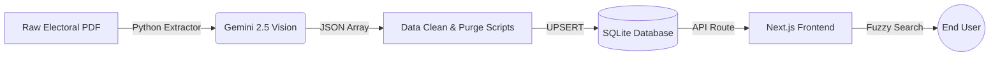

<div align="center">
  
  # 🇮🇳 Voter OCR & Search Portal
  
  **AI-Powered Electoral Roll Extraction & Lightning-Fast Search App**
  
  [](https://github.com/Shagarwal07)
  [](https://nextjs.org/)
  [](https://sqlite.org/)
  [](https://deepmind.google/technologies/gemini/)

</div>

<br />

## 📖 Overview

**Voter OCR & Search Portal** is a production-grade pipeline built to solve the complex problem of extracting structured data from dense, multi-page Indian government Electoral Rolls (PDFs) in Hindi. 

By leveraging **Google Gemini 2.5 Flash Vision AI**, this system reads massive tables, strictly enforces Hindi grammar rules, handles complex "deleted" or "supplemental" anomalies, and saves the pristine data into an offline SQLite database. 

The accompanying frontend is a gorgeous, glassmorphism-styled **Next.js** application that provides instant, fuzzy search capabilities across thousands of voters.

---

## ✨ Key Features

- **🧠 Zero-Shot AI Vision Extraction**: Processes 59-page PDFs containing thousands of tiny grid boxes. Accurately extracts Hindi names, serial numbers, Epic IDs, ages, and translates gender.
- **🛡️ Ghost Voter Purging**: Programmatically intercepts and deletes "ghost" voters who were stamped as 'DELETED' in the physical document but lacked metadata.
- **🔄 Smart UPSERT Pipeline**: Safely handles document addendums and supplemental pages. Re-scans single pages and overwrites corrupted data without duplicating rows.
- **⚡ Next.js Glassmorphism UI**: A premium, responsive web application featuring real-time fuzzy search, expandable voter cards, and dynamic database counters.
- **💾 100% Offline Database**: Uses a blazing-fast local SQLite database (`voters.db`), requiring zero cloud database hosting costs for the frontend.

---

## 🛠️ Technology Stack

| Category | Technology |
| --- | --- |
| **AI Model** | Google Gemini 2.5 Flash (Vertex AI) |
| **Backend Scripts** | Python 3, `pypdf`, `sqlite3` |
| **Database** | SQLite3 |
| **Frontend Web App** | Next.js 14, React, Tailwind CSS |
| **Design System** | Lucide Icons, Glassmorphism UI |

---

## 🚀 Quick Start

### 1. Run the Next.js Search Portal
Navigate into the frontend directory and start the local server:
```bash
cd nextjs-search-app
npm install
npm run dev
```
Open `http://localhost:3000` to interact with the database!

### 2. Run the AI Extraction Pipeline
If you want to extract a new Electoral Roll PDF, activate your Python virtual environment and run the extractor:
```bash
# Set up Google Cloud Auth first
gcloud auth application-default login

# Run the batch extractor
python extractor.py "path/to/voter_list.pdf" --ward 5
```

---

## 🏗️ Architecture



---

<div align="center">
  <br />
  <p>
    <i>Architected and designed with ❤️ by <b>World.s Services</b></i>
  </p>
</div>