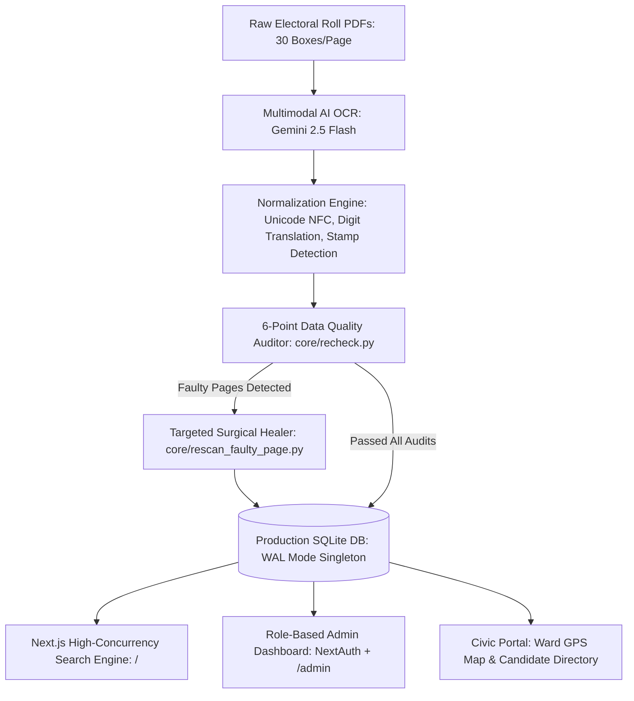
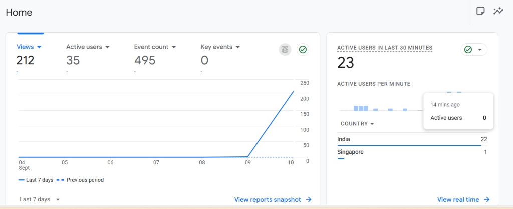
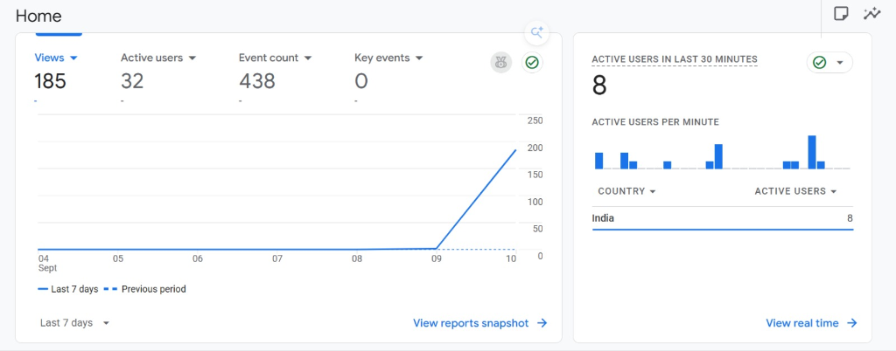
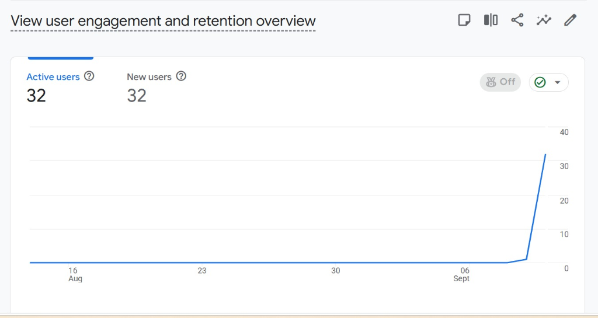

<div align="center">
  
  # 🇮🇳 Voter OCR & Search Portal
  
  **AI-Powered Electoral Roll Processing, Automated Healing & High-Performance Search Platform**
  
  [](https://github.com/Shubhamagarwal2073)
  [](https://nextjs.org/)
  [](https://cloud.google.com/)
  [](https://ai.google.dev/)
  [](https://www.sqlite.org/)
  [](https://www.typescriptlang.org/)

</div>

<br />

## 📖 Overview

**Voter OCR & Search Portal** is an end-to-end, production-tested civic technology platform built to digitize, clean, index, and query massive Hindi Electoral Rolls (Voter Lists) in real-time. 

Designed specifically for field volunteers, booth coordinators, and citizens during election operations, the platform replaces cumbersome 50+ page physical PDF rolls with **sub-second, typo-tolerant digital lookups** on mobile and desktop devices.

---

## 🏛️ System Architecture



### Key Architectural Components
1. **Multimodal AI OCR Pipeline (`core/`)**:
   * Uses **Gemini 2.5 Flash Vision** with single-page high-resolution extraction, completely eliminating row-splitting and matra corruption.
   * Handles Hindi/English code-switching, Devanagari digit translation (`DEV_NUM_MAP`), Hindi label stripping, and deletion stamp detection (`DELETED`, `SHIFTED`, `विलोपित`, `निरस्त`, serial prefixes `S`, `E`, `R`).
   * **Centralized AI Factory (`core/ai_config.py`)**: One-line model switching between Vertex AI and Free Google AI Studio API keys with automatic exponential backoff.
   * **Targeted Surgical Page Healer (`core/rescan_faulty_page.py`)**: Rescans and repairs only faulty pages without re-extracting entire 50-page PDFs.
2. **Next.js High-Speed Search Application (`nextjs-search-app/`)**:
   * **< 1.5ms Query Latency**: Direct prepared SQL statements on SQLite configured with `PRAGMA journal_mode = WAL` (Write-Ahead Logging) and `busy_timeout = 5000`.
   * **Role-Based Access Control**: NextAuth Google OAuth with role-based restrictions (`admin` vs `volunteer`) and ward permission filtering (`allowed_wards`).
   * **Edge Security**: Next.js Edge Middleware protecting admin routes before page rendering.
3. **Civic Voter Engagement Portal (`voter-portal-frontend/`)**:
   * **Interactive Ward GPS Map**: Leaflet interactive boundary maps for 55 Wards.
   * **Candidate Directory**: Fast, static JSON-backed candidate roster with party symbols.
   * **Voter Selfie Booth**: Browser-based camera generating branded civic voter certificates.

---

## 📊 Real-World Production Analytics & Field Impact

During live election polling in Ward 5, the platform was deployed directly to booth volunteers, poll workers, and family coordinators. 

<div align="center">
  
</div>

### Key Election-Day Metrics:
* **212+ Page Views** & **495 Interaction Events** recorded during active polling hours.
* **35+ Active Field Volunteers** running real-time lookups simultaneously.
* **23 Concurrent Active Users** during the peak morning turnout rush (100% organic field adoption).
* **Instant Sub-Second Lookups**: Reduced voter lookup time from 3–5 minutes per voter in physical paper rolls to less than **2 seconds** on mobile devices.

<div align="center">
  
  
</div>

---

## 🚀 Zero-to-Production Quickstart Guide

Follow these steps to set up the entire platform from a fresh clone to a full production deployment.

### Step 1: System Requirements & Cloning

#### Prerequisites
* **Python**: 3.10 or higher
* **Node.js**: 20 LTS or higher (`npm` included)
* **SQLite3**

```bash
# Clone the repository
git clone https://github.com/Shubhamagarwal2073/voter-search-app.git
cd voter-search-app

# Set up environment variables from template
cp .env.example .env
```

---

### Step 2: Python Environment & OCR Setup

```bash
# 1. Create and activate a Python virtual environment
python3 -m venv venv
source venv/bin/activate  # On Windows: .\venv\Scripts\activate

# 2. Install Python dependencies
pip install -r requirements.txt

# 3. Configure Gemini AI API Key (Get free key from https://aistudio.google.com/)
export GEMINI_API_KEY="AIzaSyYourGoogleAIStudioKeyHere..."

# Optional: Switch model if desired (default is gemini-2.5-flash)
export GEMINI_MODEL="gemini-2.5-flash"
```

---

### Step 3: Extracting Electoral Rolls into SQLite

Place your electoral roll PDFs in `input_pdfs/` (e.g. `input_pdfs/Ward No-005-Part No-001.pdf`):

```bash
# 1. Extract a single PDF (Ward number auto-detected from filename)
python core/extractor.py "input_pdfs/Ward No-005-Part No-001.pdf"

# 2. Or run the automated multi-ward batch pipeline
python core/auto_pipeline.py --batch 5

# 3. Audit database quality & Devanagari purity (Ward 5)
python core/recheck.py --ward 5

# 4. If any pages are flagged with missing serials or low contrast, heal them surgically:
python core/rescan_faulty_page.py --pdf "input_pdfs/Ward No-005-Part No-001.pdf" --pages "3,5,10-12" --ward 5

# 5. Extract candidate directory PDF with party symbols
python scripts/extract_candidates.py --pdf "input_pdfs/candidates.pdf" --output "outputs/json/candidates.json"
```

---

### Step 4: Running Locally (Development)

```bash
cd nextjs-search-app

# 1. Configure local environment variables
cp ../.env.example .env.local

# 2. Install dependencies
npm install

# 3. Start the Next.js development server
npm run dev
```
Open **[http://localhost:3000](http://localhost:3000)** in your browser. The search portal is live and connected to `data/voters.db`!

---

### Step 5: Full Production Deployment on Cloud VM / VPS

To deploy the portal on an Ubuntu 22.04 LTS or Debian cloud instance (Google Cloud Compute Engine, AWS EC2, DigitalOcean, or Hetzner):

#### A. Configure 2GB SWAP File (Critical for 1GB RAM instances)
Prevents Node.js builds and traffic spikes from crashing due to Linux Out-Of-Memory kills:
```bash
sudo fallocate -l 2G /swapfile
sudo chmod 600 /swapfile
sudo mkswap /swapfile
sudo swapon /swapfile
echo '/swapfile none swap sw 0 0' | sudo tee -a /etc/fstab
```

#### B. Build & Run with PM2 Process Manager
```bash
# Install PM2 globally
sudo npm install -g pm2

# Build production bundle
cd nextjs-search-app
npm run build

# Start daemonized server
pm2 start npm --name "voter-app" -- start

# Enable automatic start on system reboot
pm2 startup
pm2 save
```

#### C. Setup Automatic HTTPS with Caddy Reverse Proxy
Caddy provides automated Let's Encrypt SSL certificates with zero manual certbot renewal:
```bash
# Install Caddy
sudo apt install -y debian-keyring debian-archive-keyring apt-transport-https
curl -1sLf 'https://dl.cloudsmith.io/public/caddy/stable/gpg.key' | sudo gpg --dearmor -o /usr/share/keyrings/caddy-stable-archive-keyring.gpg
curl -1sLf 'https://dl.cloudsmith.io/public/caddy/stable/debian.deb.txt' | sudo tee /etc/apt/sources.list.d/caddy-stable.list
sudo apt update && sudo apt install caddy -y

# Launch HTTPS reverse proxy (pointing to your domain)
sudo caddy reverse-proxy --from https://yourdomain.com --to 127.0.0.1:3000
```

> [!TIP]
> If using Google Cloud Compute Engine, make sure to reserve your external IP as a **Static IP** in GCP Console (`VPC network` $\to$ `IP addresses`) so restarting the VM does not change your domain's DNS resolution!

---

## 🛠️ Complete Operational Commands Guide

| Goal / Task | Command to Run | Where to Run |
| :--- | :--- | :--- |
| **Run OCR for a batch of 5 wards** | `python core/auto_pipeline.py --batch 5` | Terminal |
| **Run OCR for a single specific ward** | `python core/auto_pipeline.py --ward 7` | Terminal |
| **Extract single PDF locally** | `python core/extractor.py "input_pdfs/Ward No-007.pdf"` | Terminal |
| **Audit database quality for Ward 7** | `python core/recheck.py --ward 7` | Terminal |
| **Audit all wards in database** | `python core/recheck.py --all` | Terminal |
| **Surgically heal flagged pages** | `python core/rescan_faulty_page.py --pdf "input_pdfs/Ward-007.pdf" --pages "3,5,10-12" --ward 7` | Terminal |
| **Update additions/deletions from last 3 pages** | `python scripts/update_last_n_pages.py --pdf "input_pdfs/Ward-007.pdf" --pages 3 --ward 7` | Terminal |
| **Extract candidate directory PDF** | `python scripts/extract_candidates.py --pdf "input_pdfs/candidates.pdf" --output "outputs/json/candidates.json"` | Terminal |
| **Sync Cloud JSONs to SQLite** | `python core/cloud_sync.py --dataset nagar_parishad` | Terminal |
| **Switch model to Gemini 2.0 Flash** | `export GEMINI_MODEL="gemini-2.0-flash"` | Any terminal |
| **Switch to Free Google AI Studio API Key** | `export GEMINI_API_KEY="AIzaSyYourStudioApiKeyHere..."` | Any terminal |
| **Multi-key rotation (bypasses quota)** | `export GEMINI_API_KEY="AIzaSyKey1...,AIzaSyKey2..."` | Any terminal |
| **Run Next.js locally (Development)** | `cd nextjs-search-app && npm run dev` | Local machine |
| **Build & Run Next.js (Production)** | `cd nextjs-search-app && npm run build && npm start` | Production VM |
| **Check server status & live logs** | `pm2 status` and `pm2 logs voter-app` | Production VM |
| **Restart server after code changes** | `pm2 restart voter-app` | Production VM |
| **Run Caddy HTTPS reverse proxy** | `caddy reverse-proxy --from https://yourdomain.com --to 127.0.0.1:3000` | Production VM |

---

## 🗂️ Project Repository Structure

```text
voter-search-app/
├── core/                     # Gemini 2.5 Flash OCR engine & audit/recheck pipeline
│   ├── ai_config.py          # Central AI model factory & API key rate limit management
│   ├── auto_pipeline.py      # End-to-end automated multi-ward extraction runner
│   ├── extractor.py          # Full-page high-fidelity electoral roll extractor
│   ├── cloud_extractor.py    # Multi-threaded cloud roll extractor with cover-page skipping
│   ├── cloud_sync.py         # Cloud Storage JSON to local SQLite database sync tool
│   ├── database.py           # SQLite connection pool & active/deleted voter upsert logic
│   ├── recheck.py            # 6-point data quality & Devanagari accuracy auditor
│   └── rescan_faulty_page.py # Dynamic surgical page healer with CLI arguments
├── docs/                     # Project documentation & analytics artifacts
│   ├── analytics/            # Production analytics verification proof screenshots
│   └── INTERVIEW_PREP.md     # System architecture, deep technical concepts & interview Q&A
├── nextjs-search-app/        # Core search engine & volunteer portal
│   ├── data/                 # SQLite databases (voters.db, auth.db)
│   └── src/
│       ├── app/              # Next.js App Router (Search, Admin, Voting pad)
│       ├── lib/db.ts         # Persistent SQLite Singleton with WAL mode
│       └── middleware.ts     # Edge security protecting /admin and /api/admin
├── outputs/                  # Generated datasets & exports
│   ├── excel_csv/            # Ward Block & Gali CSVs and combined Excel workbooks
│   └── json/                 # Candidate directory and ward JSON outputs
├── scripts/                  # Operational utilities and batch update scripts
│   ├── extract_candidates.py # Candidate directory PDF extractor
│   ├── update_last_n_pages.py# Last N pages updater for roll additions/deletions
│   └── run_all_updates.ps1   # Batch update helper for electoral roll additions
├── voter-portal-frontend/    # Public civic engagement portal (Ward map, selfie booth)
├── .env.example              # Template environment variables
├── .gitignore                # Complete database and secret isolation rules
├── Dockerfile
├── README.md
└── requirements.txt
```

---

## ⚖️ Legal & Compliance Disclaimer

**Voter OCR & Search Portal** is an independent, non-partisan public convenience initiative developed by independent volunteers (**Imposter World Services**). It is **NOT** affiliated with, endorsed by, or representing the Election Commission of India (ECI) or any State Election Commission. All voter data presented is parsed from publicly released electoral roll PDFs solely to facilitate faster search for booth volunteers on election day. For official verification, please visit the official Election Commission portal at [eci.gov.in](https://eci.gov.in/).

---

<div align="center">
  <p><i>Engineered with ❤️ for seamless democratic participation by <b>Imposter World Services</b></i></p>
</div>