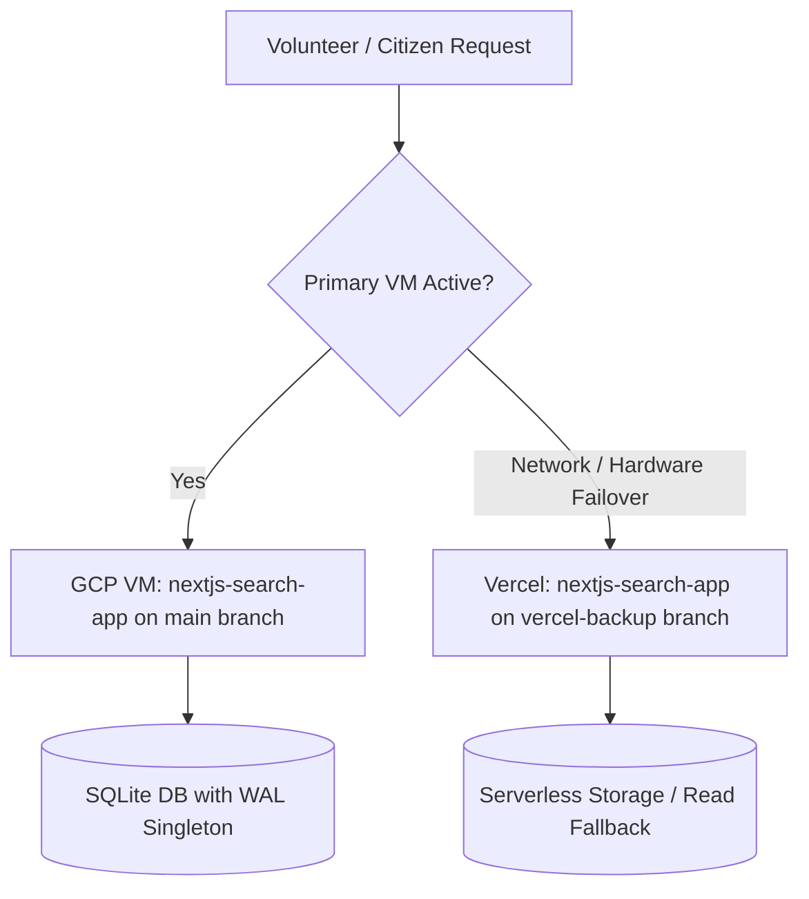

<div align="center">
  
  # 🇮🇳 Voter OCR & Search Portal
  
  **AI-Powered Electoral Roll Processing, Volunteer Ground Operations & High-Availability Search Platform**
  
  [](https://github.com/Shagarwal07)
  [](https://nextjs.org/)
  [](https://cloud.google.com/)
  [](https://vercel.com/)
  [](https://cloud.google.com/vertex-ai)

</div>

<br />

## 📖 Overview

**Voter OCR & Search Portal** is a production-tested civic technology platform built to extract, clean, index, and query massive Hindi Electoral Rolls (Voter Lists) in real-time. Designed specifically for ground-level volunteers, booth workers, and citizens during election day operations, the platform replaces cumbersome 50+ page PDFs with instant, typo-tolerant digital searches.

---

## 🏛️ High-Availability Dual-Deployment Architecture

To guarantee zero downtime on election day, the application operates on a redundant **dual-cloud strategy**:

| Deployment Target | Branch | Role & Configuration |
| :--- | :--- | :--- |
| **GCP Compute Engine VM** | `main` | **Primary Production Server** (`34-46-101-158.nip.io`). Daemonized with PM2, persistent SQLite with WAL (Write-Ahead Logging), NextAuth administration dashboard, rate limiting, and quota enforcement. |
| **Vercel Cloud** | `vercel-backup` | **Instant Failover / Hot Standby**. Serverless architecture deployed automatically from the `vercel-backup` branch. If the VM ever suffers network interruptions or hardware maintenance, volunteers instantly switch to Vercel with zero downtime. |



---

## 📊 Real-World Production Analytics & Field Impact

During live election polling in Ward 5, the platform was deployed directly to booth volunteers, poll workers, and family coordinators. 

<div align="center">
  
</div>

### Key Election-Day Metrics:
* **212+ Page Views** & **495 Interaction Events** recorded during active polling hours.
* **35+ Active Field Volunteers** running real-time lookups simultaneously.
* **23 Concurrent Active Users** during the peak morning turnout rush (100% organic field adoption).
* **Instant Sub-Second Lookups**: Reduced voter lookup time from 3–5 minutes per voter in physical paper rolls to less than **2 seconds** on mobile devices.

<div align="center">
  
  
</div>

---

## ✨ Key Platform Features

### 1. Ground Operations & Volunteer Tools
* **Live Voting Calculator Pad (`/voting`)**: Interactive on-device keypad allowing booth workers to mark votes slip-by-slip, calculate turnout percentages in real-time, and cross-reference unvoted voters.
* **Gali & Block Distribution**: Groups voters by physical neighborhoods (Galis/Colonies) to help volunteers organize targeted voter turnout drives.

### 2. High-Accuracy AI OCR Engine (`core/`)
* **Gemini 2.5 Flash Vision**: Single-page high-resolution extraction preventing row-splitting matra corruption.
* **Devanagari Normalization**: Strict Unicode NFC normalization, Devanagari digit translation (`DEV_NUM_MAP`), Hindi/English label prefix stripping, and deletion stamp detection (`DELETED`, `SHIFTED`, `विलोपित`, `निरस्त`, serial prefixes `S`, `E`, `R`).
* **Centralized AI Architecture (`core/ai_config.py`)**: One-click model switching and seamless transition between GCP Vertex AI and Free Google AI Studio API keys.
* **Quality Audit Pipeline (`core/recheck.py`)**: Automated verification testing Hindi spelling purity, serial number continuity cross-referenced against deletion lists, and low-density pages.
* **Targeted Page Healer (`core/rescan_faulty_page.py`)**: Dynamic surgical healer that re-extracts only flagged pages with atomic database upserts.

### 3. Civic Voter Portal (`voter-portal-frontend/`)
* **Interactive Ward Map**: Leaflet GPS map showing boundaries, polling station locations, and category allocations for 55 Wards.
* **Candidate Directory**: Fast, static JSON-backed candidate roster with party symbol icons and Hindi transliteration search.
* **Voter Selfie Booth**: Browser-based digital camera generating branded "PROUD VOTER" certificates to encourage civic participation.

---

## 🗂️ Project Repository Structure

```text
Voter_scrap/
├── core/                     # Gemini 2.5 Flash OCR engine & audit/recheck pipeline
│   ├── ai_config.py          # Central AI model factory & API key rate limit management
│   ├── auto_pipeline.py      # End-to-end automated multi-ward extraction runner
│   ├── extractor.py          # Full-page high-fidelity electoral roll extractor
│   ├── cloud_extractor.py    # Multi-threaded cloud roll extractor with cover-page skipping
│   ├── cloud_sync.py         # Cloud Storage JSON to local SQLite database sync tool
│   ├── database.py           # SQLite connection pool & active/deleted voter upsert logic
│   ├── recheck.py            # 6-point data quality & Devanagari accuracy auditor
│   └── rescan_faulty_page.py # Dynamic surgical page healer with CLI arguments
├── docs/                     # Project documentation & analytics artifacts
│   ├── analytics/            # Google Analytics verification proof screenshots
│   └── INTERVIEW_PREP.md     # System architecture, deep technical concepts & interview Q&A
├── nextjs-search-app/        # Core search engine & volunteer portal (GCP & Vercel)
│   ├── data/                 # SQLite databases (voters.db, auth.db, ward5_voting.db)
│   └── src/
│       ├── app/              # Next.js App Router (Search, Admin, Voting pad)
│       ├── lib/db.ts         # Persistent SQLite Singleton with WAL mode
│       └── middleware.ts     # Edge security protecting /admin and /api/admin
├── outputs/                  # Generated datasets & exports
│   ├── excel_csv/            # Ward Block & Gali CSVs and combined Excel workbooks
│   └── json/                 # Candidate directory and ward JSON outputs
├── scripts/                  # Operational utilities and batch update scripts
│   ├── extract_candidates.py # Candidate directory PDF extractor
│   ├── update_last_n_pages.py# Last N pages updater for roll additions/deletions
│   └── run_all_updates.ps1   # Batch update helper for electoral roll additions
├── voter-portal-frontend/    # Public civic engagement portal (Ward map, selfie booth)
├── Dockerfile
├── README.md
└── requirements.txt
```

---

## 🛠️ Complete Operational Commands Guide

### ⚡ Quick Command Reference ("Which command do I run for my task?")

| Goal / Task | Command to Run | Where to Run |
| :--- | :--- | :--- |
| **Run OCR for all remaining wards** | `python core/auto_pipeline.py` | Cloud Shell / VM |
| **Run OCR for a test batch of 5 wards** | `python core/auto_pipeline.py --batch 5` | Cloud Shell / VM |
| **Run OCR for a single ward (e.g. Ward 7)** | `python core/auto_pipeline.py --ward 7` | Cloud Shell / VM |
| **Extract single PDF locally** | `python core/extractor.py "input_pdfs/Ward No-007-Part No-001.pdf"` | Local / VM |
| **Audit database quality for Ward 7** | `python core/recheck.py --ward 7` | Local / VM |
| **Audit all wards in database** | `python core/recheck.py --all` | Local / VM |
| **Surgically heal pages 3, 5, 10-12** | `python core/rescan_faulty_page.py --pdf "input_pdfs/Ward-007.pdf" --pages "3,5,10-12" --ward 7` | Local / VM |
| **Update additions/deletions from last 3 pages** | `python scripts/update_last_n_pages.py --pdf "input_pdfs/Ward-007.pdf" --pages 3 --ward 7` | Local / VM |
| **Extract candidate directory PDF** | `python scripts/extract_candidates.py --pdf "input_pdfs/candidates.pdf" --output "outputs/json/candidates.json"` | Local / VM |
| **Sync GCS JSONs to SQLite** | `python core/cloud_sync.py --dataset nagar_parishad` | Local / VM |
| **Switch model to Gemini 2.0 Flash** | `export GEMINI_MODEL="gemini-2.0-flash"` | Any terminal |
| **Switch to Free Google AI Studio** | `export GEMINI_API_KEY="AIzaSyYourStudioApiKeyHere..."` | Any terminal |
| **Run Next.js locally (Development)** | `cd nextjs-search-app && npm run dev` | Local |
| **Build & Run Next.js (Production)** | `cd nextjs-search-app && npm run build && npm start` | VM / Local |
| **Check server status & live logs** | `pm2 status` and `pm2 logs voter-app` | GCP VM |
| **Restart server after code changes** | `pm2 restart voter-app` | GCP VM |
| **Run Caddy HTTPS reverse proxy** | `caddy reverse-proxy --from https://34-46-101-158.nip.io --to 127.0.0.1:3000` | GCP VM |
| **Deploy failover updates to Vercel** | `git checkout vercel-backup && git merge main && git push origin vercel-backup` | Local |

---

### 1. Automated Multi-Ward Extraction Pipeline (`core/auto_pipeline.py`)
Automatically detects all unextracted PDFs in the GCS archive bucket, skips protected wards, extracts concurrently with 5 workers per PDF, uploads output JSONs, syncs to SQLite, and runs an audit:

```bash
# Run automated pipeline for all remaining wards in the archive
python core/auto_pipeline.py

# Run for a test batch of 5 wards
python core/auto_pipeline.py --batch 5

# Run for a single specific ward
python core/auto_pipeline.py --ward 7

# Dry-run mode: list target wards without downloading or extracting
python core/auto_pipeline.py --dry-run
```

> [!NOTE]
> **Protected Wards**: Wards `1, 3, 5, 6, 11, 19, 31, 49` are strictly preserved and never overwritten or re-extracted by the automated pipeline.

---

### 2. Single PDF Extraction & Quality Audit

```bash
# 1. Extract a single PDF (Ward number is auto-detected from filename)
python core/extractor.py "input_pdfs/Ward No-007-Part No-001.pdf"

# 2. Extract with custom worker thread count
python core/extractor.py "input_pdfs/Ward No-007-Part No-001.pdf" --workers 5

# 3. Audit database quality & Devanagari purity (scoped to Ward 7)
python core/recheck.py --ward 7

# 4. Audit all wards in the database
python core/recheck.py --all

# 5. Surgically heal specific faulty pages identified during audit
python core/rescan_faulty_page.py --pdf "input_pdfs/Ward No-007-Part No-001.pdf" --pages "3,5,10-12" --ward 7
```

---

### 3. Electoral Roll Additions & Candidate Directory Utilities (`scripts/`)

```bash
# 1. Update only additions / deletions from the last N supplementary pages of a roll
python scripts/update_last_n_pages.py --pdf "input_pdfs/Ward No-007-Part No-001.pdf" --pages 3 --ward 7

# 2. Extract candidate directory PDF with party symbols into structured JSON
python scripts/extract_candidates.py --pdf "input_pdfs/candidates.pdf" --output "outputs/json/candidates.json"
```

---

### 4. Syncing Cloud JSONs to Local Database (`core/cloud_sync.py`)

```bash
# Sync all extracted JSONs from Cloud Storage into nextjs-search-app/data/voters.db
python core/cloud_sync.py --dataset nagar_parishad

# Sync scoped to a single ward
python core/cloud_sync.py --dataset nagar_parishad --ward 7
```

---

### 5. Changing Models & Switching to Free Google AI Studio

You can change the Gemini model or switch between GCP Vertex AI and Free Google AI Studio with **zero code changes**:

```bash
# Option A: Change the model project-wide (e.g. to Gemini 2.0 Flash)
export GEMINI_MODEL="gemini-2.0-flash"

# Option B: Switch to Free Google AI Studio (API Key mode with 15 RPM auto-throttling)
export GEMINI_API_KEY="AIzaSyYourStudioApiKeyHere..."

# Option C: Multi-key rotation (bypasses 1,500 requests/day limit)
export GEMINI_API_KEY="AIzaSyKey1...,AIzaSyKey2..."
```

---

### 6. Running the Web Application (`nextjs-search-app`)

```bash
cd nextjs-search-app

# Development mode
npm run dev

# Production build & start
npm run build
npm start

# Production on VM with PM2 (daemonized)
pm2 start npm --name "voter-app" -- start
pm2 logs voter-app
pm2 restart voter-app
pm2 save
```

> [!WARNING]
> **GCP VM Resizing Safety Rule (Static IP Reservation)**:
> Before stopping the VM to resize from `e2-medium` to `e2-micro`, you **MUST** reserve the external IP as a **Static IP** in GCP Console (`VPC network` $\to$ `IP addresses`). If the IP changes, `nip.io`, Caddy SSL certificates, and Google OAuth callback redirect URIs will immediately break!

---

## ⚖️ Legal & Compliance Disclaimer

**Voter OCR & Search Portal** is an independent, non-partisan public convenience initiative developed by independent volunteers (**Imposter World Services**). It is **NOT** affiliated with, endorsed by, or representing the Election Commission of India (ECI) or any State Election Commission. All voter data presented is parsed from publicly released electoral roll PDFs solely to facilitate faster search for booth volunteers on election day. For official verification, please visit the official Election Commission portal at [eci.gov.in](https://eci.gov.in/).

---

<div align="center">
  <p><i>Engineered with ❤️ for seamless democratic participation by <b>Imposter World Services</b></i></p>
</div>